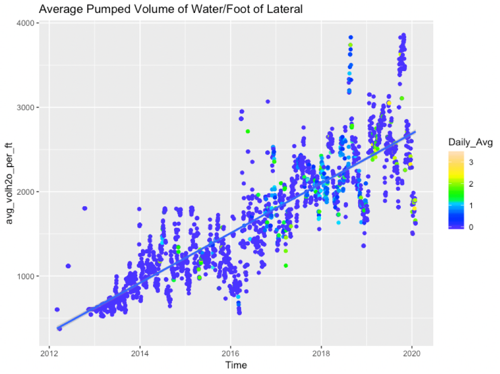
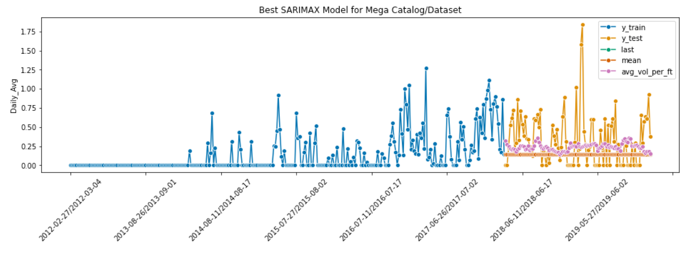

## Predicting Induced Seismicity in the Eagle Ford Shale Trend

This project was released on 3/3/2021, so the statistics represented below might be outdated.

### Table of Contents
Below is a table of contents, which contains the folder name, folder order, file name, file order, and file description. The file order column represents which order the files should be opened and read. File Order 1 should be started with. There is also an additional table that outlines the oil_and_gas_data folder in more detail.

**Folder Name**|**Folder Order**|**File Name**|**File Order**|**File Description**
:-----:|:-----:|:-----:|:-----:|:-----:
Main|0|README.md|1|The README file contains the executive summary and overview of the project as a whole.
Main|0|Predicting_Seismicity_Presentation.ppt|2|This is the ppt version of the project presentation.
Main|0|Predicting_Seismicity_Presentation.pdf|3|This is the pdf version of the project presentation.
Main|0|Fasola_et_al_2019.pdf|4|Reference paper that sheds light on induced seismicity in the project area.
code|1|01_Data_Gathering_and_Cleaning.ipynb|1|In this notebook I gather the raw and process the raw data.
code|1|02_EDA.ipynb|2|In this notebook I perform Exploratory Data Analysis on the cleaned data.
code|1|03_Modelling_SARIMA.ipynb|3|This notebook contains the main SARIMA/SKTIME models for the project.
code|1|04_Modelling_RNN.ipynb|4|This notebook contains the main RNN models for the project.
code|1|seismicity_plots_R.Rmd|5|This is an R-Studio notebook that contains enhanced plots/visuals.
oil_and_gas_data|2|various folders|0|Please see additional chart below for explanations of this folder.
images|3|Pumped_Vol_Lateral_over_Time.png|1|Image of the change in pumped volume in completions over time.
images|3|Best_SARIMA_model.png|2|Image of forecast using production SARIMA model.
old_code|4|old version of notebooks|3|You can skip this folder, unless you want to see very detailed modelling.

**Folder Name**|**Folder Order**|**File Name**|**File Order**|**File Description**
:-----:|:-----:|:-----:|:-----:|:-----:
raw_data|1|Fasola_etal_2019_GRL_data_set.csv|1|This is the supplemental information for the Fasola et al 2019 publication.
raw_data|1|Fasola_etal_2019_GRL_data_set.xlsx|2|This is the dataset corresponding the Fasola et al 2019 publication.
raw_data|1|PET_PRI_SPT_S1_D.csv|3|This is the csv version of the WTI and Brent Spot Price data.
raw_data|1|PET_PRI_SPT_S1_D.xls|4|The .xls version of the WTI and Brent Spot Price data.
raw_data|1|PET_PRI_SPT_S1_D.xlsx|5|The .xlsx version of the WTI and Brent Spot Price data.
raw_data|1|Rigs by State_012921.xls|6|The rig count information from Baker Hughes.
raw_data|1|Rigs by State_012921.xlsx|7|The .xlsx equivalent for rig count information.
raw_data|1|texnet_events.csv|8|The raw seismicity event catalog from TexNet website.
raw_data|1|usgs_events.csv|9|The raw seismicity event catalog from the USGS website.
frac_focus|2|karnes_1_21.csv|1-21|These are the .csv files for Karnes specifically made in notebook 01.
catalogs|3|final_texnet_data.csv|1|This is the final cleaned seismicity catalog for the TexNet data.
catalogs|3|final_usgs_catalog.csv|2|This is the final cleaned seismicity catalog for the USGS data up to Jan 2017.
catalogs|3|final_usgs_all_events_catalog.csv|3|This is the final cleaned seismicity catgalog for all USGS data.
catalogs|3|total_seismicity_catalog.csv|4|This is the combined, cleaned catalog for TexNet and USGS data.
catalogs|3|faosla_texnet_catalog.csv|5|This is the combined, cleaned catalog for Fasola and TexNet data.
catalogs|3|all_three_catalogs.csv|6|This the mega catalog that has the USGS, Fasola, and TexNet data combined.
data_for_modelling|4|data_ready_for_modelling.csv|1|This is the TexNet and USGS dataset with corresponding reference data.
data_for_modelling|4|fasola_data_ready_for_modelling.csv|2|This the Fasola and TexNet dataset with reference data.
data_for_modelling|4|mega_data_ready_for_modelling.csv|3|This is data for all three catalogs combined with reference data.
reference_data|5|completion_information_by_day.csv|1|This is the organized completion information referenced by date.
reference_data|5|reference_completion_information.csv|2|This is all of the completion information for Karnes County.
reference_data|5|filled_commodity_price.csv|3|This is the condensed commodity pricing information from EIA.
reference_data|5|filled_rig_count.csv|4|This is the condensed rig count information from Baker Hughes.

#### The Problem
Despite several decades of oil and gas production in the South Texas Eagle Ford Shale Trend, there has been a relatively recent uptick in the frequency and severity of earthquakes, attributed to oil production activity (Fasola et al 2019). While the exact mechanisms of the source of this increased seismicity is unknown, it is concentrated along the NE-SW trending fault system referred to as the Karnes Trough. In this project, I attempt to better understand the mechanisms that drive the increased seismicity by modelling activity-related parameters, such as completion size, duration, total volume of water used, and volume per lateral length.

#### The Solution
In addition to real-time monitoring of seismicity near their operations, if oil and gas operators can better understand the mechanisms that drive the seismicity, they can experiment with alterations to their completion techniques and avoid inducing earthquakes in the future. Better understanding of what is causing the uptick in seismicity can be another tool in the belt of operators who develop near the Karnes Trough.

Through the use of time series forecasting, I attempt to use the completion parameters mentioned above to model possible drivers of seismicity and try to predict the level of seismicity over time. I focused primarily on SARIMA auto-regression models as well as Recurrent Neural Network modelling to conduct this investigation.

#### Evaluation Metrics
To accomplish this task, I applied domain knowledge to both the fields of artificial intelligence and energy to obtain a time series forecaster which performed above the null model in both accuracy (using the AIC score in the case of the SARIMA models) and rmse. Experimentation was conducted to better understand optimal targets, such as the Daily Average Size of Events, the Daily Count of Events, the Daily Sum of the size of the events, and whether the overall seismicity increased or decreased relative to the previous day. Various models were run using these targets, as well as experimenting with three different catalogs and the activity/completion-related features. For each experiment, a null model was established and the performance of the model was compared to its corresponding rmse and accuracy scores relative to the null. I chose to use rmse as a metric as minimizing error in predicting seismicity is important.

#### Data Acquisition and Preprocessing
This project involved obtaining datasets from many different sources. I explain the source for each dataset used in the 01_Data_Gathering_and_Cleaning notebook. Each of the three seismicity catalogs were derived from either the TexNet website (https://www.beg.utexas.edu/texnet-cisr/texnet/earthquake-catalog), the USGS earthquake site (https://earthquake.usgs.gov/earthquakes/search/), or from the Fasola et al 2019 publication (https://agupubs.onlinelibrary.wiley.com/doi/abs/10.1029/2019GL085167). The FracFocus database was used to gather information on the completion activity in Karnes County (https://www.fracfocus.org/). The rig count information was obtained through Baker Hughes' website (https://rigcount.bakerhughes.com/na-rig-count), and the WTI and Brent spot price information was obtained through the Energy Information Agency (https://www.eia.gov/dnav/pet/pet_pri_spt_s1_d.htm). Each of these datasets were read in and processed in the 01_Data_Gathering_and_Cleaning notebook.

Once the data were read in and cleaned, it needed to be consolidated and combined into a format that paired with the daily seismicity catalogs. This was done consistently between the catalogs to make modelling more streamlined. The specific pre-processing required after that was unique to the SARIMA and RNN modelling, so that work was done in those respective notebooks.

#### EDA and Findings
The EDA for this project turned out to be interesting, especially when comparing the completions parameters over time. The most telling of these findings is the size of the completions in Karnes over the last ~10 years. As it is in many onshore US basins, the amount of pumped water to induce fractures in the target reservoir has increased dramatically. The Eagle Ford Shale trend is no exception, and the plot below shows that the average pumped volume of water per lateral foot (assuming mile long laterals for all wells) has gone from ~300 gallons in 2012 to ~2500 gallons in 2020. In the plot, I have colored the data by the average daily magnitude in seismicity, and I believe there is a trend between the average daily size of earthquake events and this dramatic increase in injected water volume.

#### Final Production Model
Two final production models were found, one using SARIMA and the other using a Recurrent Neural Network. In both cases, the best model results were obtained using the Mega catalog consisting of the historical USGS dataset, the Fasola et al dataset, and the more recent TexNet dataset. I believe this catalog performed the best, in part, due to its wide time range, which provided more than ample training data. Additionally, the best models utilized the Daily_Average target, which turned out to be the best target to predict for; both best models also contained the Average Volume of Water Injected per Lateral Ft feature. While both productions did not yield stellar results in terms of accuracy, they did beat their corresponding null models in terms of rmse scores.

An image of the best SARIMA can be seen here, which predicts the seismicity that occurred through 2018 into early 2020.

#### The Conclusion
My venture to create a seismicity prediction model that performed above the null model was successful. The final production models utilize key features that correlate to industry activity and completion techniques. While the exact mechanisms for inducing seismicity are not 100% clear, I believe the frequent modelled success using injection rate/ft lateral gives us an indication that the large injection volumes used in modern completions have a role to play.

#### Improvements and Future Work
Though the models show promise, there are improvements to note going forward. Each of the catalogs vary in terms of magnitude accuracy, density of events, etc. It would be ideal to have a more complete dataset of similar time duration as the Mega catalog, but enhanced through template matching techniques as used in the Fasola et al dataset. Additinally, it would also be interesting to further investigate the amount of sand proppant used in completions over time, and take a look at the number of completions going in per square mile. I imagine that larger amounts of modern completions performed in a smaller area near the Karnes Trough would likely correlate to seismicity.

In terms of modelling, I'd like to continue testing model parameters in both the SARIMA and RNN models. I did not discover that Daily_Average was the best target to model for until nearly the end of the project, so going back and doing more modelling for that target might yield better results in each of the catalogs. I would also like to make predictions for the year 2021, especially with the added complexity that the COVID-19 pandemic induced into the energy industry.

#### Citations & Sources
1. S.L. Fasola, M.R. Brudzinksi, R.J. Skoumal, T. Langenkamp, B.S. Currie, K.J. Smart, “Hydraulic Fracture Injection Strategy Influences the Probability of Earthquakes in the Eagle Ford Shale Play of South Texas” Geophysical Research Letters, Vol. 46, Issue 22, 2019, pp. 12958 - 12967.
